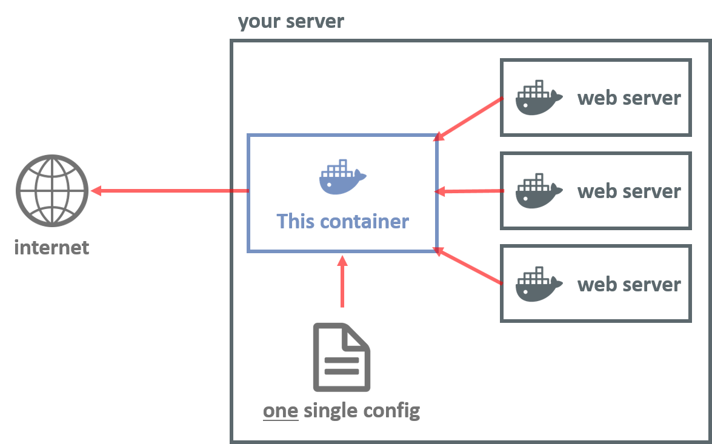

# TheClockTwister's Reverse Rroxy

This Docker image significantly reduces the stress and effort needed to set-up
and maintain a reverse proxy to supply multiple domains/subdomains/hostnames 
on one single host (with one IP address). To minimize the set-up effort and 
further maximize compatibility and portability, the whole application can be 
hosted inside a single container with nothing needed except the configuration file.




## Features

### Implemented
- only __one__ single configuration file
- High-performance web proxy using Nginx
- Auto-restart on config change
- easily deployed using Docker

### Comming soon
- Auto-configuration for CloudFlare
- Enable/Disable auto-restart on config change at will


## The configuration file
A typical configuration looks as follows:
```json
{
  "nginx": {
    "example.com": {
      "www.example.com": {
        "type": "GENERIC",
        "endpoint": "http://10.20.0.14:1234"
      },
      "support.example.com": {
        "type": "GENERIC",
        "endpoint": "http://10.20.0.14:9876"
      }
    },
    "another-page.com": {
      "www.another-page.com": {
        "type": "WORDPRESS",
        "endpoint": "http://10.20.0.14:1111"
      },
      "info.another-page.com": {
        "type": "GENERIC",
        "endpoint": "http://10.20.0.14:2222"
      }
    }
  },
  "server": {
    "config_check_interval": 10
  }
}
```
As you can already see, the structure is quite simple:
- `nginx`
  - `DOMAIN1`
    - `SUBDOMAIN`
      - `type`: A preset configuration for the proxy. Can be "GENERIC", "WORDPRESS" or "EMBY". Nearly all services work fine with "GENERIC" or "WORDPRESS".
      - `endpoint`: The URL of your web service, which shall be delivered on this subdomain.

- `server`: Configs for the container.
  - `config_check_interval`: The interval at which the container checks for a changed config and restarts the service. 